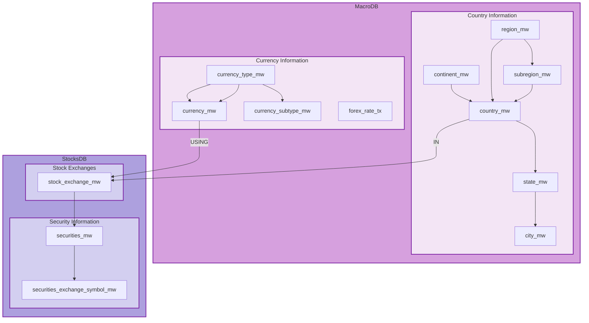

<div align = "center">

# AivenIO Database Manager

[](https://github.com/aivenio)


[](https://www.gnu.org/licenses/gpl-3.0.en.html)
[](https://github.com/orgs/aivenio/discussions)
[](https://github.com/sponsors/aivenio)
[](https://github.com/orgs/aivenio/people)

[](https://github.com/aivenio/macrodb/releases)
[](https://github.com/aivenio/stocksdb/releases)
[](https://github.com/aivenio/tradesdb/releases)

</div>

<div align = "justify">

👋 [**`AivenIO`**](https://github.com/aivenio) is a scalable database platform built for modern data services - fully managed,
cloud-native, and highly adaptable to your specific requirements. The usage is infinite - from a collection of awesome data for
projects or integration with applications that provide data-driven (backed) decision-making for a holistic picture in the fields
of (but not limited to) science and technology, finance, and macroeconomic factors.

## ✨ Getting Started

The repository provides PostgreSQL as the de facto backend database, divided into *microservices* that can work independently or
in coordination with other projects. The different microservices can either be configured in separate servers (clouds, systems)
or can be configured in the same host under a different named schema. Check our [website](https://aivenio.github.io/) or our
community discussion [page](https://github.com/orgs/aivenio/discussions) for more details. Check the individual project's updated
release from the badges.

### PUBLISHER → SUBSCRIPTION Database Tables

We're using logical replication (WAL) to sync data between different database tables, which is the practical way to manage foreign
key constraints across the servers. As an end user, if you are using **two** different servers, then the normal process should be
enough as below:

```pgsql
CREATE PUBICATION ...; -- on the publication server
CREATE SUBSCRIPTION ...; -- on the subscription server
```

However, if you are **using the same server with two different databases** (typically useful for data management, etc.), then
you may need to create a slot replication (in the subscriber server) method as per the detailed debugging steps below:

```pgsql
CREATE SUBSCRIPTION ...
  WITH (
    create_slot = false, enabled = false,
    slot_name = ...
  );

ALTER SUBSCRIPTION <slot-name> ENABLE;
```

A *practical deep-down documentation* is available [here](../docs/logicalReplication.md). This document was created from the
original server logs and steps to fix the issue.

### High-Level ER Diagram

The flowchart provides a high-level overview of the *information* available under different microservices and their
relationship with each other. For a detailed ER diagram, refer to the [`schema.dbml`](https://dbml.dbdiagram.io/home) file
in the respective repository.



The diagram is designed to highlight the relationships between the two independent micro-services using *publication* rules
of the PostgreSQL database. A relationship is maintained in a `PUBLICATION → SUBSCRIPTION` format for understanding. A set
of important cross-functional linkages are as follows:

  1. A country has one/more listed stock exchanges (`country_mw --IN--> stock_exchange_mw`) where a security
    is being traded. Cros-functional link is maintained via the **`macrodb_geography_table`** publication.
  2. A security exchange primarily operates using (`currency_mw --USING--> stock_exchange_mw`) a set of currency
    which is part of the country. Cross-functional link is maintained via the **`macrodb_currency_table`** publication.

## ⚖ Project Licensing

Our projects strictly follow [`GNU GPL v3`](https://www.gnu.org/licenses/gpl-3.0.en.html), a strong copy-left license. Please
refer to the individual `LICENSE` file in each repository for complete information and important terms and conditions.

## ⚠ Project Disclaimer

The service is intended solely to provide a data structure that enables efficient management of databases containing various
data points that can be used effectively for analysis. Certain *non-sensitive data* that is *available in the public domain*
may be distributed with the project. Other data may not be shared, and the source of the same may not be disclosed; the
organization is under no obligation to make such data available to the general public.

In a certain project, there might be information available on tradable securities. Any information or discussions are for
general information and educational purposes only. It does not constitute financial, investment, legal, tax, or accounting
advice, and should not be relied upon as such.

All content, including but not limited to market data, analysis, commentary, and any other materials, is provided in good
faith but without warranty of any kind, express or implied. We make no representation or guarantee regarding the accuracy,
completeness, or timeliness of any information presented.

</div>
